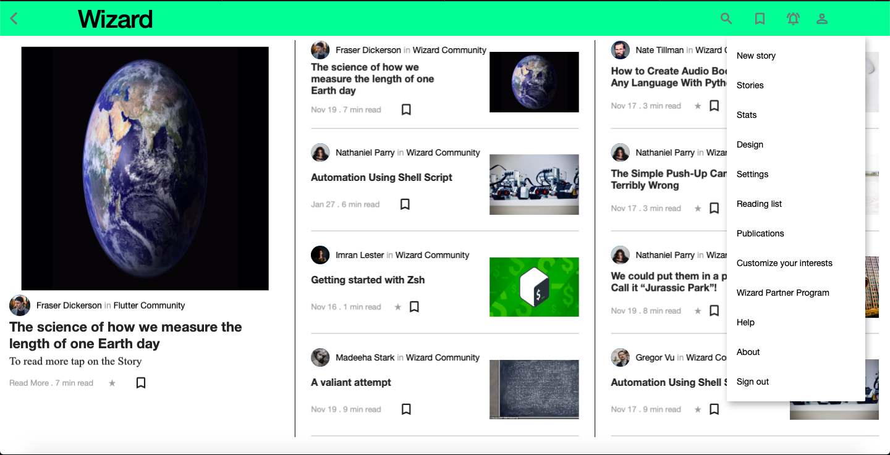

<h1 align="center">Wizard</h1>
<h3 align="center">
 
<i>An Online Publishing Platform Web App built using using <a href="https://flutter.dev/">Flutter 💕</a> & <a href="https://firebase.google.com/">Firebase 🔥</a>  </i>
  </h3>

## About the Web App 🥘

  - Wizard is a Web App to post and view blogs for various topics 🤤!
  
  - Login or SignUp using any account (P.S. Your credentials are safe!) 🤩 and this will lead you to the feed page.
  
  - You can post your own blog for any topic.

  - Blog must be valid markdown file without any kinds of errors.

  - For uploading/posting, markdown file must be of certain kind (Soon will be updated)
  
  - All the data is stored in Firebase 🔥. Because of Firestore database you'll get the latest and  intresting blogs 🍔. Also, web app uses Getx package 😎 for state management.

  - [Check the live Web App](https://wizard-17895.web.app)

## ✨ Features
- [x] SignIn/SignUp/SignOut.
- [x] Posting New Story.
- [x] Viewing the stories.
- [x] Bookmarking the stories.
- [x] Search and Filtering.
- [ ] Dark Mode.

## 📸 ScreenShots
|||
|:-------------:|:-------------:|
|||
|||
|||
|||

## 🔌 Plugins
| Name | Usage |
|------|-------|
|[**Getx**](https://pub.dev/packages/get)| State Management|
|[**Markdown_widget**](https://pub.dev/packages/markdown_widget)| To render the markdown content|
|[**Flutter_dropzone**](https://pub.dev/packages/flutter_dropzone)| To handle drag-and-drop|
|[**Mime Type**](https://pub.dev/packages/mime_type)| Get mime type of a file|
|[**File_picker**](https://pub.dev/packages/file_picker)| To Pick the file from local storage|
|[**Url_launcher**](https://pub.dev/packages/url_launcher)| To launch the url|
|[**Lint**](https://pub.dev/packages/lint)| To lint the project|

## 🔖 LICENCE
[MIT License](https://github.com/rustiever/wizard/blob/main/LICENSE.md)